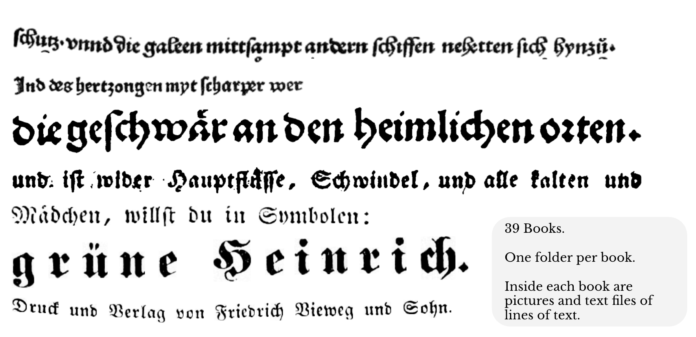
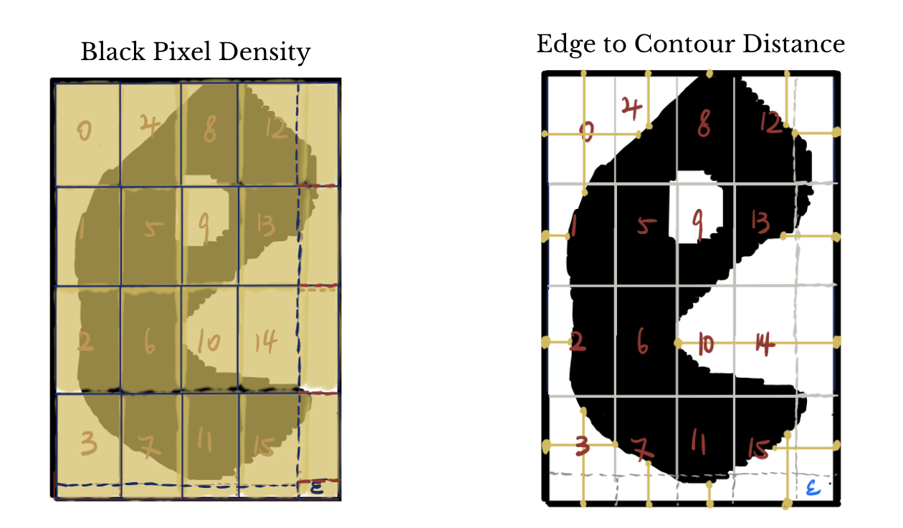
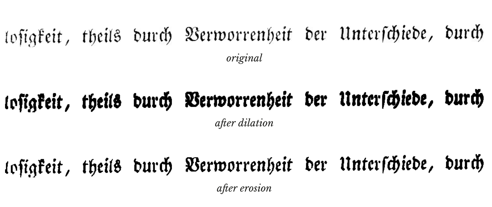
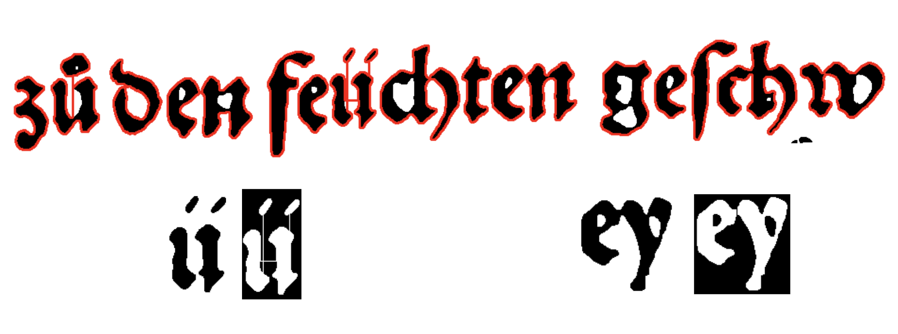
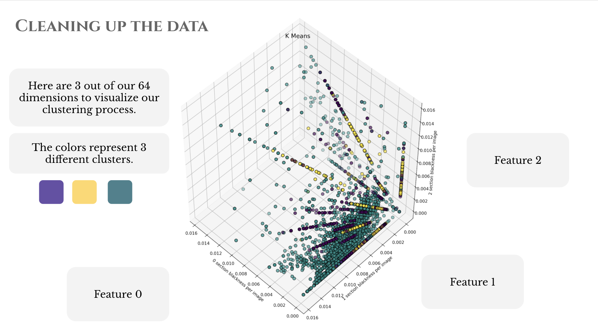
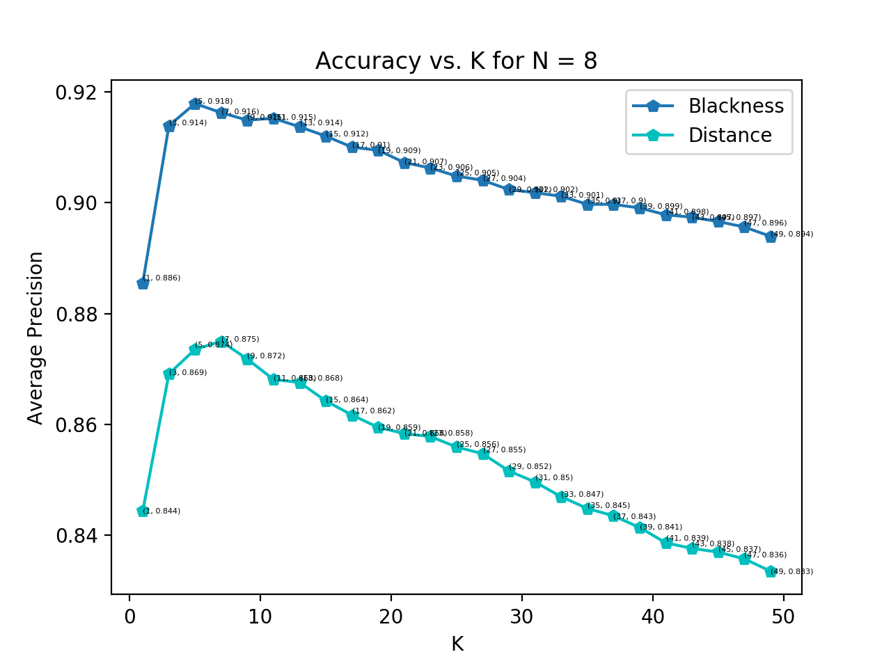
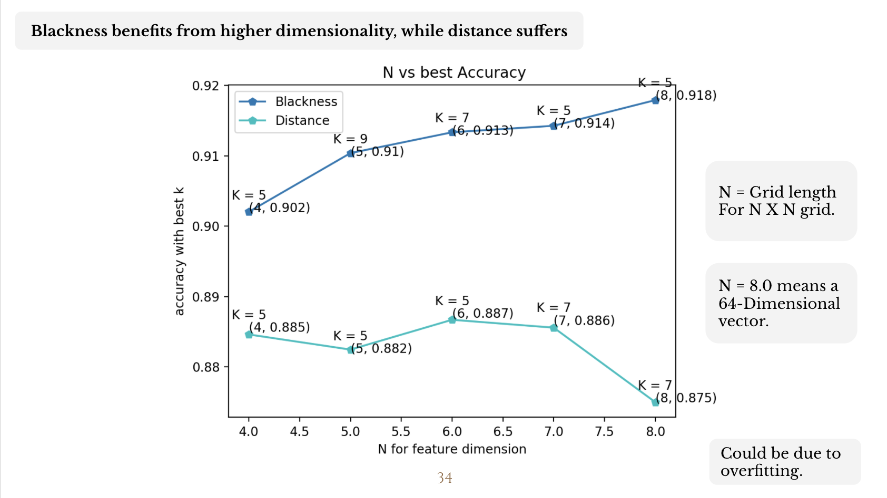

# Fraktur Cracker

Automated transcription of historical texts is an often explored challenge in the field of optical character recognition. Our project aims to apply a basic similarity-based approach to OCR for transcription of the Fraktur letter font, often used in historical German texts. Using a zoning-based black pixel density feature we were able to achieve approximately 92% character recognition accuracy using a k-NN classifier. 

**Dataset**: GT4HistOCR- 300,000 ground truth images with labels
**Model**: k-nearest neighbors classifier
**Methodology**:
* Preprocessing
* Character segmentation
* Data cleaning 
* Feature extraction
* Model selection
* Evaluation

### Dataset

Our dataset consisted of scanned lines of Fraktur text from German books and the corresponding transcriptions for each line.

### Features

We tested two features, one being black pixel density and the other being edge to countour distance. Each image was divided into equal sections, and the black pixel density was measured for each section. The edge to countour distance was measured for each of the outermost sections.

### Preprocessing

Each image went through some initial preprocessing to optimize legibility.

### Character Segmentation

Because our dataset consisted of lines of text, we had to figure out how to automatically segment the lines into indivudal characters. We used OpenCV countours to try and detect the boundaries of each letter, shown in red. We ran into some challenges such as some letters such as "u" or "n" being split up, some letters blending into the next, and also attaching umlauts and diacritics to the base letter.

### Data Cleaning

Once we segmented the characters, we had to clean up the data to take care of mistakes in segmentation and labeling. For each letter, we used K-means clustering to look for outlier images that were mislabelled, by taking the largest cluster to be the correct one.

### Results 

We chose to use a k-nearest neighbors classifier since it's a common technique used to approach OCR, and is especially useful when our number of samples far exceeds our dimensionality.Overall, the black pixel density feature proved to be a better metric than the distance feature. The model that had the highest accuracy (92%) used the black pixel density feature and had a k value of 5.

As shown in the graph below, the accuracy decreases as k is increased.

We also tested the effect of increasing the number of zones used to divide up each letter image. It appears that increasing the number of zones improves accuracy for the black pixel density feature, but not for the distance feature. In the graph below, the best k value was used for each number of zones (N). 

